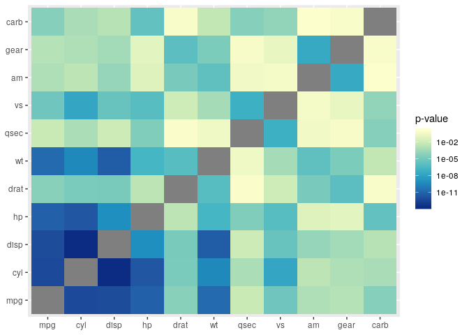
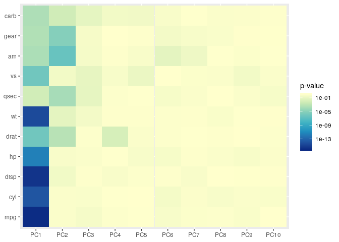

<!-- README.md is generated from README.Rmd. Please edit that file -->
nalar
=====

nalar is my personal R package in which I will place various code for
analysis and plotting that I find useful and plan to use a lot. I'll try
to keep it documented, tested and working, so feel free to use.

Installation
------------

You can install the released version of nalar from
[github](https://www.github.com/Alanocallaghan/nalar) with:

    install_github("Alanocallaghan/nalar")

    load_all()
    #> Loading nalar
    #> Creating a generic function from function 'associate' in package 'nalar'
    #> Creating a generic function from function 'pca_association_plot' in package 'nalar'
    library("nalar")
    association_plot(mtcars)

    pca_association_plot(mtcars, method = "prcomp")

